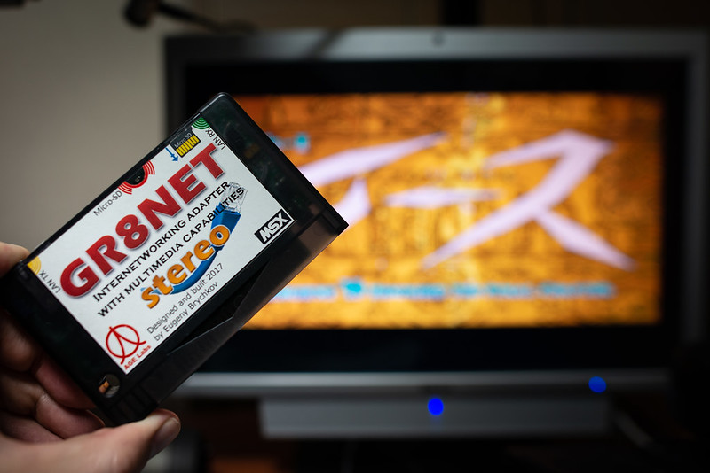
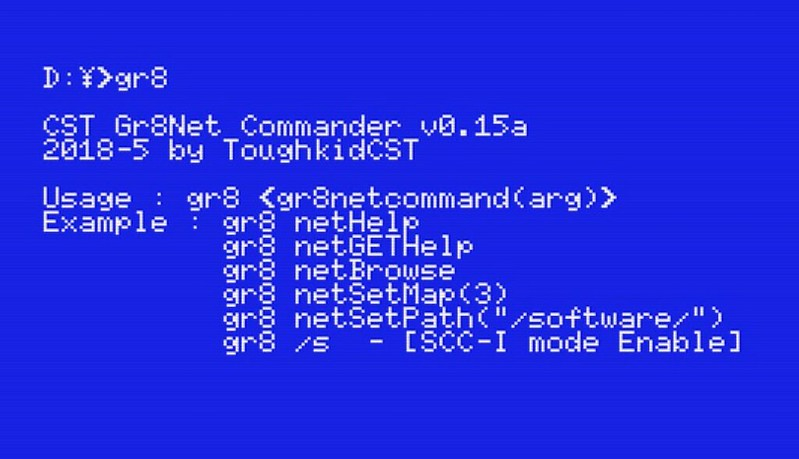

# gr8
MSX-DOS2 GR8NET Commander - GR8.COM

MSX-DOS GR8net Commander - GR8.COM v0.15a updated  
           for GR8net Engine & Flash firmware version 0.12 (2020/09)

           Usage : gr8 [gr8netcommand(arg)]
           Example :  gr8 netHelp
                      gr8 netGetHelp
                      gr8 netBrowse
                      gr8 netSetMap(3)
                      gr8 netSetPath("/software/")
                      gr8 /s        - Enable GR8net's SCC-I mode
                      gr8 /s0      - Enable GR8net's SCC mode

https://www.youtube.com/watch?v=yPeiLBX8aBQ&list=PLlD0W14KLTkr44mWPCBUlEGvaTg-CPvtK
